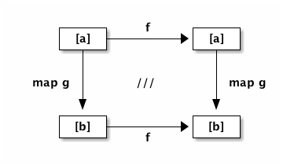

それでは、Frege をめぐる冒険を、普通とはかなり趣の違うルートから始めましょう。

`"Hello, World"` 構文を披露する代わりに、ここでは _等式推論_ の例を初めに持ってきました。

Frege を用いることで、ここで述べるような設計とリファクタリングのための新手法を、JVM 上で使用することができます。Frege が採用している純粋関数型プログラミングの考え方は、プログラムに対して、数学の道具立てに深く根ざした確固たる基礎付けを与えることにつながるのです。

そこで、他の言語で可能なことはもちろんすべて Frege でも可能ですが、他の JVM 言語では実現でき _ない_ ような Frege の利点から解説を始めます。

それでは、開幕です！

== タネも仕掛けも

最初に、任意の型のリストを、まったく同じ型を持つ他のリストにうつす関数 _f_ について考えましょう。

Frege の言葉で言えば、このような関数 _f_ は以下で宣言されます。

[source, haskell]
----
f :: [a] -> [a]
----

.仮定することなかれ
NOTE: ここでは、_a_ 型の値が持つ機能について何も仮定することができません。したがって関数 _f_ ができることは非常に制限されます。例えば _a_ は算術演算をサポートしているかどうかわからないため、_f_ がリスト内のすべての要素に「1 を足す」ことは不可能です。

それでは、本当にこのまま行ってみましょう。*_f_ としてこのような任意の関数を考え、正体はわからないとします！*

次に、型 `a → b` を持つ、すなわち与えられた型に対して他の型の値を返すような、何か _特定の_ 関数 _g_ を考えます。例えば以下のように選ぶことができます。

.Int から String への関数 g の例
[source, haskell]
----
g :: Int -> String
g x = show x ++ show x ++ show x
----

つまり、`g 1` は文字列 `"111"` を返すことになるでしょう。

しかし実際には、ここで用いる特定の関数 _g_ として、想像が及ぶ限りの任意の関数を用いることができます。

.ここで手品の第一幕
* _g_ に渡すことのできる値のリスト (上の例では Int 値のリスト) を作成
* 次に、そのリストに正体不明の _f_ を適用
* さらにその結果を `map g` に与える
* _g_ の返り値からなるリストが手に入る

できましたか？

.それでは次に第二幕
* 第一幕でスタート地点にしたものと同じリストから始める
* 今度は、そのリストに先に _map g_ を適用する
* その後で正体不明の関数 _f_ を適用する

.ジャジャーン！
IMPORTANT: 今回も同じ結果になるはずです！

それでは、例で考えてみましょう。`reverse` 関数を _f_ として選んだと仮定します。_いずれにせよ、これは心の中にとどめておきます。いいですね？_

まずはこのリストから始めて、

[source, haskell]
----
[1, 2, 3]
----

_reverse_ を適用し、

[source, haskell]
----
reverse [1,2,3]
----

さらに _map g_ に渡します。これを順次簡約すると以下が得られます。

[source, haskell]
----
map g (reverse [1,2,3])
map g [3, 2, 1]
["333", "222", "111"]
----

ではもう一つの方です。最初にマッピング、それから反転させると

[source, haskell]
----
reverse (map g [1, 2, 3])
reverse ["111", "222", "333"]
["333", "222", "111"]
----

*はい、同じ結果になりました！*

TIP: ここで見た性質は、純粋関数型の世界でのみ成り立つなかなか面白い定理 (「リスト関手に対する自然変換」) です。この定理は *安全な並び替え* を保証してくれますが、もし仮に何らかの代入や状態の変更、副作用が存在する場合、定理の成立は期待できなくなります。

以下はこの定理を図で表したものです。

.ファンクタ合成の可換図式

左上の角から右下の角に向かって進みます。どちらのルート（まず右に行って下に行く、もしくはまず下に行って右に行く）でも同じ結果を得ることができます。

図中の /// は数学的な記法で、図式が可換であることを表します。_学校の数学でこの記法が登場した時、私は自分が実際に使うことなどないだろうと思っていました。みなさん、それは間違いでしたよ！_

=== その他の例

今回、_g_ に対しては（純粋であることを除き）それほど多くの制限をかけていません。g が関数 `g x = println x` であるときなど、`IO ()` のような IO 型を返す場合であってもやはり正しく動作します。この場合、戻り値は (未実行の) IO アクションのリストであり、その他の場合と同じくもとのリストを逆転したものになります。

_f_ については状況が異なります。`[a]` を `[a]` にうつす関数は少数しか存在しません。しかしこの型で  _Hoogle_ 検索すれば、面白いものがいくつか表示されます。`reverse` の他にも、`id` は当然として `tail` (先頭以外の全ての要素)、`init` (末尾以外の全ての要素)、や 現在のリストを際限なく繰り返すことで無限リストを作り出す `cycle`が存在します。

.決め手は純粋性
NOTE: ここで登場した定理は、他の JVM 言語でも同じように成立するでしょうか？ 答えは否。この定理が成り立つためには関数の純粋性が必要なのです。

=== 参考文献

[horizontal]
Hoogle [a]→[a]:: https://www.haskell.org/hoogle/?hoogle=%5Ba%5D+-%3E+%5Ba%5D
Phil Wadler:: Tech Mesh 2012 - Faith, Evolution, and Programming Languages: from Haskell to Java https://www.youtube.com/watch?v=NZeDRs6snm0
Bartosz Milewski::
http://bartoszmilewski.com/2015/04/07/natural-transformations/[Natural
Transformations], https://www.youtube.com/watch?v=2LJC-XD5Ffo[video], http://bartoszmilewski.com/2015/04/07/natural-transformations/[The Yoneda Lemma]
Math3ma:: http://www.math3ma.com/mathema/2017/2/6/what-is-a-natural-transformation[What is a natural transformation]
Functor:: http://en.wikipedia.org/wiki/Functor
