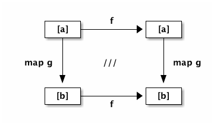

# タネも仕掛けも

最初に、任意の型のリストを、まったく同じ型を持つ他のリストにうつす関数 _f_ について考えましょう。

Frege の言葉で言えば、このような関数 _f_ は以下で宣言されます。

```
f :: [a] -> [a]
```

Note: 仮定することなかれ: ここでは、_a_ 型の値が持つ機能について何も仮定することができません。したがって関数 _f_ ができることは非常に制限されます。例えば _a_ は算術演算をサポートしているかどうかわからないため、_f_ がリスト内のすべての要素に「1 を足す」ことは不可能です。

それでは、本当にこのまま行ってみましょう。**_f_ としてこのような任意の関数を考え、正体はわからないとします！**

次に、型 `a → b` を持つ、すなわち与えられた型に対して他の型の値を返すような、何か _特定の_ 関数 _g_ を考えます。例えば以下のように選ぶことができます。

Caption: Int から String への関数 g の例

```
g :: Int -> String
g x = show x ++ show x ++ show x
```

つまり、`g 1` は文字列 `"111"` を返すことになるでしょう。

しかし実際には、ここで用いる特定の関数 _g_ として、想像が及ぶ限りの任意の関数を用いることができます。

Caption: ここで手品の第一幕

* _g_ に渡すことのできる値のリスト　(上の例では Int 値のリスト) を作成
* 次に、そのリストに正体不明の _f_ を適用
* さらにその結果を `map g` に与える
* _g_ の返り値からなるリストが手に入る

できましたか？

Caption: それでは次に第二幕

* 第一幕でスタート地点にしたものと同じリストから始める
* 今度は、そのリストに先に _map g_ を適用する
* その後で正体不明の関数 _f_ を適用する

Important: ジャジャーン！ 今回も同じ結果になるはずです！

それでは、例で考えてみましょう。`reverse` 関数を _f_ として選んだと仮定します。_いずれにせよ、これは心の中にとどめておきます。いいですね？_

まずはこのリストから始めて、

```
[1, 2, 3]
```

_reverse_ を適用し、

```
reverse [1,2,3]
```

さらに _map g_ に渡します。これを順次簡約すると以下が得られます。

```
map g (reverse [1,2,3])
map g [3, 2, 1]
["333", "222", "111"]
```

ではもう一つの方です。最初にマッピング、それから反転させると

```
reverse (map g [1, 2, 3])
reverse ["111", "222", "333"]
["333", "222", "111"]
```

__はい、同じ結果になりました！__

Tip: ここで見た性質は、純粋関数型の世界でのみ成り立つなかなか面白い定理 (「リスト関手に対する自然変換」) です。この定理は __安全な並び替え__を保証してくれますが、もし仮に何らかの代入や状態の変更、副作用が存在する場合、定理の成立は期待できなくなります。

以下はこの定義を図で表したものです。

Caption: ファンクタ合成の可換図式



左上の角から右下の角に向かって進みます。どちらのルート（まず右に行って下に行く、もしくはまず下に行って右に行く）でも同じ結果を得ることができます。

図中の /// は数学的な記法で、図式が可換であることを表します。_学校の数学でこの記法が登場した時、私は自分が実際に使うことなどないだろうと思っていました。みなさん、それは間違いでしたよ！_

## その他の例

今回、_g_ に対しては（純粋であることを除き）それほど多くの制限をかけていません。g が関数 `g x = println x` であるときなど、`IO ()` のような IO 型を返す場合であってもやはり正しく動作します。この場合、戻り値は (未実行の) IO アクションのリストであり、その他の場合と同じくもとのリストを逆転したものになります。

_f_ については状況が異なります。`[a]` を `[a]` にうつす関数は少数しか存在しません。しかしこの型で  _Hoogle_ 検索すれば、面白いものがいくつか表示されます。`reverse` の他にも、`id` は当然として `tail` (先頭以外の全ての要素)、`init` (末尾以外の全ての要素)、や 現在のリストを際限なく繰り返すことで無限リストを作り出す `cycle`が存在します。

Note: 決め手は純粋性: ここで登場した定理は、他の JVM 言語でも同じように成立するでしょうか？ 答えは否。この定理が成り立つためには関数の純粋性が必要なのです。

## 参考文献

* [Hoogle `[a]→[a]`](https://www.haskell.org/hoogle/?hoogle=%5Ba%5D+-%3E+%5Ba%5D)
* Phil Wadler: [Tech Mesh 2012 - Faith, Evolution, and Programming Languages: from Haskell to Java](https://www.youtube.com/watch?v=NZeDRs6snm0)
* Bartosz Milewski: [Natural Transformations, The Yoneda Lemma](http://bartoszmilewski.com/2015/04/07/natural-transformations/)
* [Functor](http://en.wikipedia.org/wiki/Functor)
