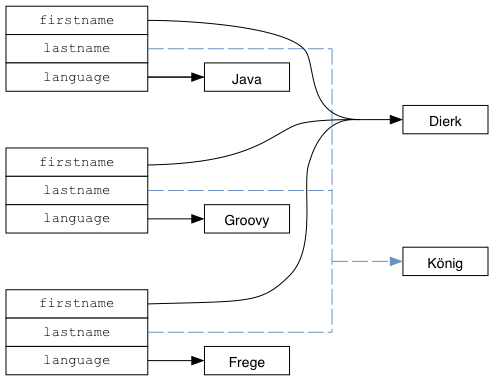
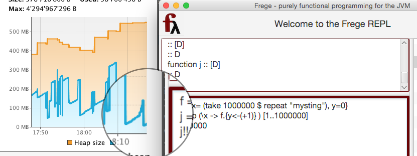

# 素晴らしきかな不変性

関数型プログラミングの基礎となるのは、扱うもののほとんどが値である、ということです。値は決して変化しません。42 は 42 であり、そこに関数 `+1` を適用したとしても、返ってくる値が 43 であるというだけで 42 はやはり 42 のままです。

値は不変データなのです。

これは、数値の場合いたって当たり前のことです。しかし文字列はどうでしょう？ 広く使われる言語のほとんどは文字列を不変データとして扱います。この手法には、他のコードに中身を書き換えられる危険性なしでデータを安全に引き回すことができるという利点があります。

Frege では、不変性が持つこの利点を、リストやマップその他標準的に使用されるデータ構造だけでなく、ユーザが定義したものまでをも含む、すべての純粋 (*) なデータ構造に拡張します。

(*) データ構造が純粋であるとは、状態の変更やその他の副作用ををまったく行わないような型を持つことを指します。

オブジェクト指向畑の人にとっては、Frege の方針はまったく実用的でないように聞こえるかもしれません。あるいは広範囲なコピーが発生してメモリを食いつぶすのではと気になるかもしれません。以下では、値によるプログラミングを用いることで、_結果的に_驚くほど僅かな対価でいくつもの利点が得られることを明らかにしていきます。

## 自作データ構造

よくある、単純なデータ構造から始めましょう。苗字、名前、および考えるのに使っているプログラミング言語を保持する _Person_ を考えます。

Caption: 単純な Person データ型

```
data Person = Person { firstname, lastname, language :: String }

javaDierk   = Person "Dierk" "König" "Java"
```

これで、`Person` 型の値 `javaDierk` を生成すれば自動的に不変データになるのです！

実際には、ここで登場している言語機能は二つあります。

* Frege には代入がないため、上記の `=` は代入ではなく定義を表します。特に、`javaDierk` を再定義して他の `Person` を指すようにすることはできません。`javaDierk` を参照する人は誰であれ、この先ずっと「Java で考えるバージョン」の Dierk を参照することになります。

* `Person` の値自体を変更することはできません。しかし、すでにあるものをベースにして新しい値を生成することは可能です。

Caption: コピーを作成してフィールドを変更する

```
groovyDierk = javaDierk.{ language = "Groovy" }
fregeDierk  = javaDierk.{ language = "Frege"  }
```

Note: ここで登場した _レコード構文_ を扱うには面白い方法が色々とあり、先の記事で取り上げる予定です。

ここまでで、三つの相異なる `Person` 型の値が得られました。変更のたびに新しいコピーが生成されています。あたかも「セッター」のように見える部分は、むしろ _コピーコンストラクタ_ のような働きをします。

しかし、三つのコピーが存在するものの、以下の図で表されるような _構造の共有 (structural sharing)_ が自動的に行われています。



Fig 1: 構造の共有による効率的な不変データの保持

我々が扱うものは _結果的_ には値であるため、例として上に挙げた String だけでなく、任意の値を _常に_ 安全に共有することができます。このような性質は、どんな種類であれ静かに忍び寄る可変性を許してしまうと達成できなかったであろうことに注意しましょう。

しかし、本当に巨大なデータを保持していて、かつそれに対して本当に多数の変更を行う場合はどうでしょう？ はい、それでは試してみましょう。データ型 `D` の値がフィールド `x` を持ち、`x` は百万個の文字列 (おそらく遅延評価の対象) を含むと仮定します。さらに別のフィールド `y` を百万回更新するとしましょう。このとき、百万個のコピーが生成されますが、先にガベージコレクションの対象になってしまうことを防ぐため、おかしなことですがすべてのコピーをそれぞれ保持しておきます。

このような上記を逸したシナリオでも、メモリ消費は、下記画像の虫眼鏡内に見えている青いグラフの右端の小さな山の分だけでしかありません。



Fig 2: 効率的で GC と相性の良いメモリ消費

不変データ構造は、シングルスレッド環境において API 提供側と使用側で共有するだけでなく、_並行実行_ や大規模な _並列計算_ においても安全に共有可能であることは言うまでもありません。

そのために支払うわずかな追加コストは、一時メモリが少し多めに必要になることと、ガベージコレクションのための余分な時間がいくらか必要になるということだけです。

Important: 不変性がデフォルト : 一番いいのは、不変性を有効にするために一文字も書く必要がないということです。全自動で行われます。

## さらに進んだ考察

何重にも入れ子になったデータ構造のコピーや比較は、高コストな操作として知られています。不変データ構造は多くの場合、参照ひとつのみをコピーすることでこの負担を軽減することができます。「コピーコンストラクタ」と呼ばれる仕組みはその良い例です。与えられた値をセットする際には、最も浅い参照のみがコピーされますが、それでもやはり _ディープコピー_ になります。

Frege で使用される標準的なデータ構造はすべて不変です。オブジェクト指向業界から来た人にとって、これは驚くべきことでしょう。例えば、連想配列はいつもその要素を変更することで使用してきました。むしろそれこそが連想配列の主目的だと思っているかもしれませんね！ 今回はその世界観を考え直す良い機会です。参考文献を調べると、この件について情報や気付きが得られるでしょう。

ここで、_dierk_ が現在、考えるのに使っている言語は何でしょう？ 三種類の参照のうちどれが使用されるのでしょうか？ 各時点で「最新版」の `Person` を一つだけ保持したほうがよいのではないでしょうか？
このような例については先の記事で扱います。また、可変な状態によって不変データ構造が破壊されることを防ぐ Frege の「からくり」についても説明することになるでしょう。

## 参考文献

* Chris Okasaki
    + "Purely Functional Data Structures" [http://www.amazon.com/Purely-Functional-Structures-Chris-Okasaki/dp/0521663504](http://www.amazon.com/Purely-Functional-Structures-Chris-Okasaki/dp/0521663504)
* Rich Hickey
    + Keynote: The Value of Values [http://www.infoq.com/presentations/Value-Values](http://www.infoq.com/presentations/Value-Values)
    + Persistent data structures [https://www.youtube.com/watch?v=hb3rurFxrZ8](https://www.youtube.com/watch?v=hb3rurFxrZ8) (min 22 ff)
