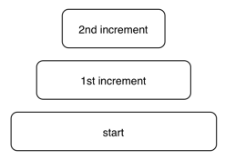

# 第三回 : 高階関数と進化するデータ型

第一回では、インクリメンタル開発について、および _非侵入的_ な状態を保つことの重要性について述べました。今回は、前回の最後の状態からコードの変更を行います。

Caption: 各段階の重なり



コードの変更は、我々が _侵入的_ であると宣言した対象ですが、最後に追加した分を変更することは許容されます。

コードに変更を入れることの問題点は、それに依存しているその他すべてのコードが危険にさらされる可能性があることです。これこそが _侵入的_ であると言われる所以です。_最後_ に追加した分に依存しているコードはおそらく存在しないため、安全に変更することができます。

理屈はともかく、与えられた盤面のミニマックス値を求めるために入れた最後の追加分を見てみましょう。

```
maxValue = maximize . static . prune 5 . gameTree
```

これはうまく動くのですが、もっと関数型 _らしく_ してみようと思います。

関数型プログラマは非常に早い段階で抽象化を導入したがること、また上記のコードには隠れた抽象が存在することはすでに見たとおりです。ここでは、盤面の木を Double 値の木にマップしていますが、木の構造はそのまま残ります。このことは _ファンクタ_ と呼ばれる抽象化の性質です。ファンクタに対しては、現在の構造を保ったまますべての要素に関数 _f_ を適用する一般された関数 _fmap_ を使用することができます。つまり今回の _Tree_ 型はこのようなファンクタなのです。

ファンクタとしての木の性質を使うために、_static_ の代わりに _fmap f_ を使います。

Caption: static を fmap static とする一般化

```
evaluateBy f = maximize . fmap f . prune 5 . gameTree

maxValue = evaluateBy static
```

_evaluateBy_ はパラメータ _f_ を取るようになったことに注意しましょう。盤面を引数として取り、_maximize_ が要求する _Ord_ を返すような関数なら何であっても _f_ として与えることができます。

_evaluateBy_ のような、他の関数をパラメータとして取る関数は __高階関数__ と呼ばれます。
高階関数は関数型プログラミングでは非常によく使用され、実際に過去の記事でも以前から特に注意もなく使ってきました。しかし今回のケースは一味違います。ここでは、非常に広く用いられる関数型機能であるところの高階関数を、_非侵入的な追加開発_ のお膳立てのために使用したのです。

## 新要件あらわる : 未来予測

ゲームで遊ぶのは楽しいものですが、ときどきコンピュータが、なぜそんな選択をしたのか理解しがたい手を打つように見えることがあります。コンピュータが何を考えているかについて推察し、それを明らかにすることができたら面白いのではないでしょうか。このためのアイデアとして、予測、すなわちゲームが進行した結果としてコンピュータが考える最終的な盤面を表示してみます。

Caption: コンピュータが自身の勝ちを知っている

この目的のために、ミニマックス値を与える盤面を見つける必要があります。結果としてこちらのほうが予測よりも簡単です。`evaluateBy` を使いますが、しかしもう `static` を渡すことはしません。その代わり、盤面を静的な評価値だけでなく、評価値と盤面自身との _組_ にマップする関数を渡します。

Caption: 静的な値と盤面を組にする

```
endValue = evaluateBy capture where
    capture board = (static board, board)
```

いい感じです。まず何より、完全に _非侵入的_ な追加になっています！ 既存のコードは全く変更していません。

次に、このコードは高階関数を用いており、新しい要件を見越していたわけではないにもかかわらず、関数型のスタイルに則った非常に自然な結果になっています。

Caption: オブジェクト指向と比較して

もし典型的なオブジェクト指向スタイルで作ったとしたら何が起こっていたか考えてみましょう。もちろん、オブジェクト指向でも似たような効果を得ることはできたでしょうが、新しいユースケースについてあらかじめ考えておく必要があります。例えばテンプレートメソッドであったり、ストラテジーパターンであったり、その他同様の手段であったり。このような用意がない限り、オブジェクト指向設計では侵入的な変更が必要になってしまいます。いずれにせよ、インクリメンタル開発はより困難になるでしょう。

しかしこのままでは問題があり、コンパイルできません。

我々が作成したマッピング関数は _Ord_ を返す必要がありますが、組は (実際には任意のタプルは) 要素すべてがやはり _Ord_ であるときのみ _Ord_ になります。_Double_ 値は _Ord_ ですが、_Board_ 型はそうではありません。

むむ、次にどうしましょう？ _Board_ の定義まで戻って変更しますか？ この場合、_侵入的_ な変更になります。

ここで Frege の型クラス (いわば Java のインタフェースに相当) が持つ大きな利点が登場します。__データ型を進化させる__ ことができるのです！ 新しくコードを追加することにより、_Board_ は完全に静的な型の安全性を保ったまま _Ord_ 型クラスのインスタンスになります！

すべての盤面が等しいとみなす以外、付け加えるロジックはありません。組を順序付けるために必要なのは、組に対して _statid_ 関数が返す _Double_ 値だけです。

Caption: 盤面はみな平等に創られており……

```
instance Ord Board where (<=>) a b = EQ
```

このコードはかなり単純に見えますが、大きな意味を内包しています。_Board_ を _Ord_ のインスタンスにするために、_Board_ 型に新たな機能を付け加えています！

Caption: 型の進化

_Board_ のソースコードが使用できない状況であっても、このインスタンス宣言は有効であることに注意してください。バイナリ形式のみ手に入るサードパーティライブラリの場合にはこのような状況が起こりえます。__外部のデータ型であっても進化させることができる__ のです。

これで全体がコンパイルできて動くようになりました。[リンク先](https://klondike.canoo.com/tictactoe/game) でゲームをプレイすると予測が効いているのがわかります。

次の回では、さらに思い切った拡張を適用します。安全な並列実行です。
