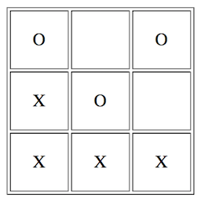

# インクリメンタル開発

関数型プログラミングが _真に_ 重要である理由、それは _インクリメンタル開発のための新しい選択肢を与えてくれる_ ことです。

とどのつまり、我々はどのようにソフトウェアを作るのでしょう？ 一度に書けるのは一行です。ソフトウェア開発というものはすべてインクリメンタルなのです。

ここではインクリメンタル開発に対して、_侵入的_ な方法と _非侵入的_ な方法、二種類のアプローチを行います。開発を進める上で既存のコードを変更し再コンパイルするような場合、そのアプローチを _侵入的_ であると呼びます。

もちろん一番良いのは、非侵入的なインクリメンタル開発を行うことで、既存のコードには全く触らず、したがって既存コードを破壊する危険がない状態でしょう！ そしてそれは時として可能です。

Caption: 最近の非侵入的インクリメンタル開発のための選択肢

* モジュール化されたアーキテクチャを採用し、コンポーネントやサービスを単純に追加できるようにする
* オブジェクト指向システムで部分型を用いて、存在する抽象に対して新しい実装を追加できるようにする
* 動的言語を採用し、既存のクラスに対して互換性のある新しいクラスを追加できるようにする

しかしこれらの選択肢にはどれも限界があります。あらかじめ想定した拡張しか扱えなかったり、複雑性が増大するという代償があったり、型安全性が弱くなったりといった何らかの問題があり、その結果将来的に再度拡張することが難しくなります。

もし、もっと安全にソフトウェアを拡張する方法があったとしたら、きっと役立つはずです。

このような問題に対する新しい選択肢として、ジョン・ヒューズは有名な論文 "[Why functional programming matters](http://www.cs.kent.ac.uk/people/staff/dat/miranda/whyfp90.pdf)" の中で関数型プログラミングについて述べました。論文中では、_モジュール性_ と、そのモジュールを組み合わせるための新しい _接着剤_ である高階関数および遅延評価の観点から論じられています。

Caption: なぜモジュール性を追い求めるのか？

モジュール性は、それ自体だけが問題なのではありません。変更の影響をひとつのモジュール内に留めたり、他の部分に触ることなくモジュールを追加・削除したりすることに役立ちます。これがあるからこそインクリメンタルな作業が可能になるのです。

この論文は今や 25 年前のものですが、いまだに関数型プログラミングに対する最大の動機のひとつであり続けています。ここに登場する例は Haskell の祖先であるプログラミング言語 Miranda で書かれています。論文の主張の筋は、最後に登場する例、ボードゲームを実装するための一般解に集約されています。

ここではまさにこのボードゲームの例を取り上げ、論文で説明されているステップに沿って、全 4 回のコースで Frege で実装していきます。何をしているかをよく理解するために、さらに理解を深めるために、そしてまず何より読むこと自体を楽しむために、並行して論文を読んでみたくなるかもしれませんね。

具体的なボードゲームとして、ここでは○×ゲーム (tic-tac-toe、別名 noughts and crosses) を使用します。このゲームは可視化するのがかなり簡単で、Frege でインクリメンタル開発を体験するという今回の演習の目的を損ないすぎない程度にシンプルなルールを持っています。

Caption: ○×ゲーム

さて、それでは第一回から始めましょう。
